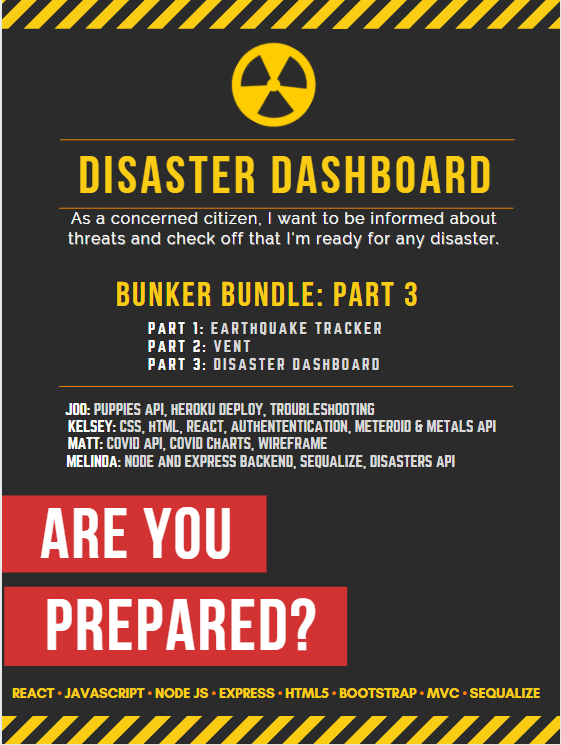

# Disaster Dashboard
 

Our third and final project is the final installation of the Bunker Bundle. The Disaster Dashboard encompasses a full-stack development project utilizing the MERN Stack. The Disaster Dashboard allows you to see current disasters, near earth events, current COVID-19 Statistics, the current price of Gold and Silver, and a checklist that allows you to verify you have the items needed to survive a disaster. Finally, to help decompress after seeing all of this information, the user can look at puppy gifs to help relax. 

We utilized multiple APIS including [EONET-NASA](https://eonet.sci.gsfc.nasa.gov/api/v3/) (Disasters), [CDC](https://data.cdc.gov/resource/) (Covid),  [NEO-NASA](https://api.nasa.gov/neo/) (Near Earth Objects), [GOLDAPI](https://www.goldapi.io/api/) (Gold & Silver), [PUPPIES](https://api.giphy.com/v1/gifs/) (Puppies), to help provide updated data to concerned citizens about critical information on and near Earth. 

## Project Demonstration
  

## Team
- [Joo Heredia](https://github.com/djjoo007): Puppies API, Heroku deploy, Troubleshooting
- [Kelsey James](https://github.com/KJ-Labs): HTML, CSS, React, Meteroids API, Metals API, Authentication
- [Matt Wibur](https://github.com/wilbur125): COVID Api, Covid Charts, Wireframe
- [Melinda Ivanov](https://github.com/jnsmelinda): Node and Express Backend, Sequalize, Disasters API

## Links
- Github: https://github.com/djjoo007/disaster_dashboard
- Heroku: https://disaster-list-dashboard.herokuapp.com/Dashboard
  - Email: testaccount@gmail.com
  - Password: GenericPassword12!

OR 

  - Email: account2@gmail.com 
  - Password: GenericPassword12!!

## Technologies
- [React](https://reactjs.org/)
- [JavaScript](https://www.javascript.com)
- [Node.js](https://nodejs.org/en/)
- [HTML5](https://en.wikipedia.org/wiki/HTML5)
- [CSS3](https://en.wikipedia.org/wiki/Cascading_Style_Sheets)
- [Git](https://git-scm.com/), [GitHub](https://github.com)
- [MySQL](https://www.mysql.com/)
- [MVC](https://en.wikipedia.org/wiki/Model%E2%80%93view%E2%80%93controller)
- [OKTA](https://www.okta.com/?utm_campaign=search_google_amer_us_ao_it_branded-okta_exact&utm_source=google&utm_medium=cpc&utm_term=okta&utm_page={url}&gclid=EAIaIQobChMIm96dr46u7QIVoj6tBh05_wo6EAAYASAAEgJsfPD_BwE)

## Installation
Installation is not needed, as the entire application is on Heroku. Please use the General Account to login here > https://disaster-list-dashboard.herokuapp.com/Dashboard . (testaccount@gmail.com, GenericPassword12!)

## Usage
Visit the heroku link, login with the test account and look at all of the disaster data. If you want to check what items are currently in the readykit, click the hamburger menu at the top left to update as necessary. If you want to see previous projects such as Earthquake Data and Air Quality Data, please utilize the links above the logout button. Please make sure to look at some adorable puppies before logging out for the day. 

## License
This repository is protected under the [MIT](https://choosealicense.com/licenses/mit/) license.

## Contribution
Please contribute to this project by opening a Pull Request and following the `eslint` rules and the [Code of Conduct](https://www.contributor-covenant.org/version/2/0/code_of_conduct/).

## Presentation PDF
  
Card images are from Canva professional. Data is not meant as professional advice, please validate any recommendations/data with a licensed professional. 
